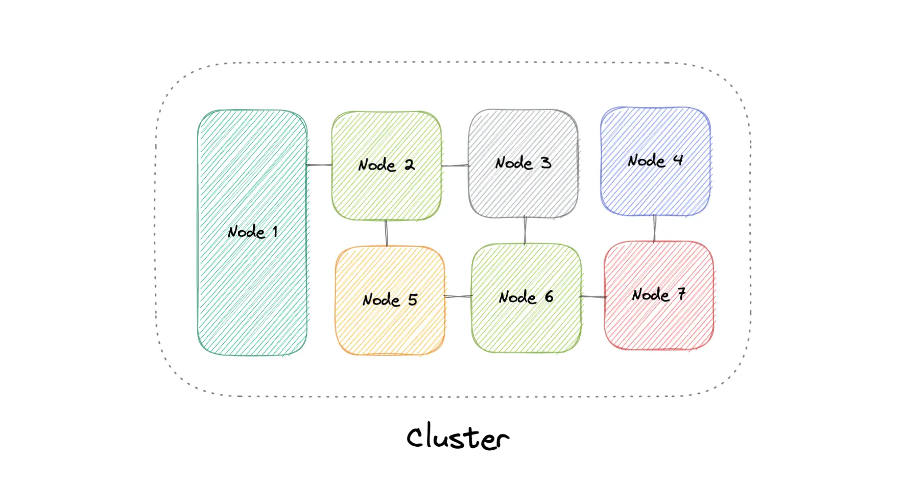
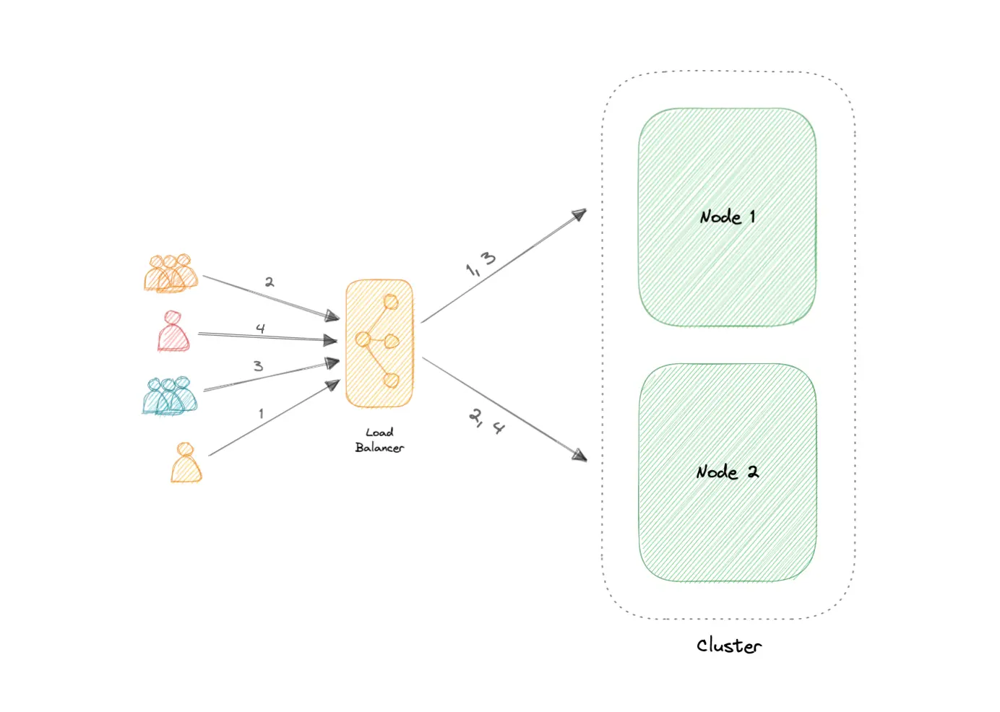

At a high level, a computer cluster is a group of two or more computers, or nodes, that run in parallel to achieve a common goal.

This allows workloads consisting of a high number of individual, parallelizable tasks to be distributed among the nodes in the cluster.

As a result, these tasks can leverage the combined memory and processing power of each computer to increase overall performance.

&nbsp;

To build a computer cluster, the individual nodes should be connected to a network to enable internode communication. The software can then be used to join the nodes together and form a cluster. It may have a shared storage device and/or local storage on each node.

&nbsp;

Typically, at least one node is designated as the leader node and acts as the entry point to the cluster. The leader node may be responsible for delegating incoming work to the other nodes and, if necessary, aggregating the results and returning a response to the user.

&nbsp;

deally, a cluster functions as if it were a single system. A user accessing the cluster should not need to know whether the system is a cluster or an individual machine. Furthermore, a cluster should be designed to minimize latency and prevent bottlenecks in node-to-node communication.

&nbsp;

## Types

Computer clusters can generally be categorized into three types:

- Highly available or fail-over
- Load balancing
- High-performance computing

&nbsp;

The two most commonly used high availability (HA) clustering configurations are active-active and active-passive.

### Active-Active

An active-active cluster is typically made up of at least two nodes, both actively running the same kind of service simultaneously. The main purpose of an active-active cluster is to achieve load balancing. A load balancer distributes workloads across all nodes to prevent any single node from getting overloaded. Because there are more nodes available to serve, there will also be an improvement in throughput and response times.

&nbsp;

* * *

### Active-Passive

&nbsp;

&nbsp;

an active-passive cluster also consists of at least two nodes. However,not all nodes are going to be active. For example, in the case of two nodes, if the first node is already active, then the second node must be passive or on standby.

&nbsp;

* * *

## Clustering Advantages

Four key advantages of cluster computing are as follows:

- High availability
- Scalability
- Performance
- Cost-effective

&nbsp;

## Load balancing vs Clustering

Load balancing shares some common traits with clustering, but they are different processes. Clustering provides redundancy and boosts capacity and availability. ==Servers in a cluster are aware of each other and work together toward a common purpose. But with load balancing, servers are not aware of each other.== Instead, they react to the requests they receive from the load balancer.

We can employ load balancing in conjunction with clustering, but it also is applicable in cases involving independent servers that share a common purpose such as to run a website, business application, web service, or some other IT resource.

## Examples

Clustering is commonly used in the industry, and often many technologies offer some sort of clustering mode. For example:

- Containers (e.g. <ins>Kubernetes</ins>, <ins>Amazon ECS</ins>)
- Databases (e.g. <ins>Cassandra</ins>, <ins>MongoDB</ins>)
- Cache (e.g. <ins>Redis</ins>)

&nbsp;

&nbsp;