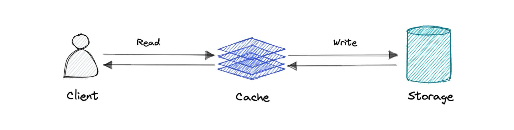
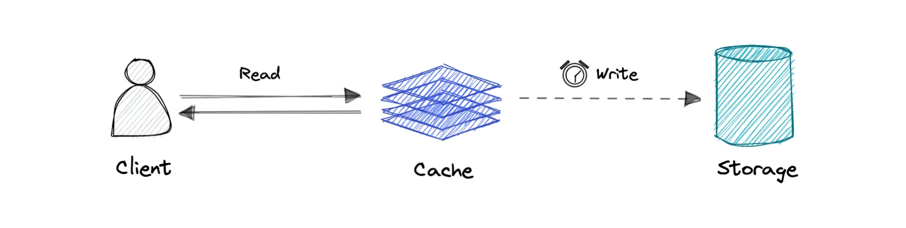
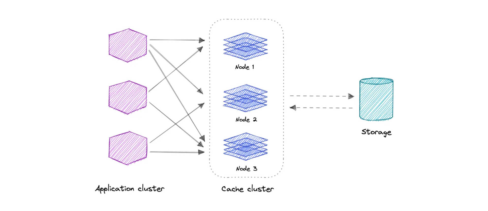

A cache's primary purpose is to increase data retrieval performance

by reducing the need to access the underlying slower storage layer.

Trading off capacity for speed, a cache typically stores a subset of data transiently, in contrast to databases whose data is usually complete and durable.

Caches take advantage of the ==locality of reference== principle *"recently requested data is likely to be requested again".*

&nbsp;

## Caching and Memory

Like a computer's memory, a cache is a compact, fast-performing memory that stores data in a hierarchy of levels, starting at level one, and progressing from there sequentially. They are labeled as L1, L2, L3, and so on. A cache also gets written if requested, such as when there has been an update and new content needs to be saved to the cache, replacing the older content that was saved.

&nbsp;

No matter whether the cache is read or written, it's done one block at a time. Each block also has a tag that includes the location where the data was stored in the cache. 

When data is requested from the cache, a search occurs through the tags to find the specific content that's needed in level one (L1) of the memory. If the correct data isn't found, more searches are conducted in L2.

&nbsp;

If the data isn't found there, searches are continued in L3, then L4, and so on until it has been found, If the data isn't found in the cache at all, then it's written into it for quick retrieval the next time.

&nbsp;

* * *

### Cache hit

A cache hit describes the situation where content is successfully served from the cache. The tags are searched in the memory rapidly, and when the data is found and read, it's considered a cache hit.

### Cache miss

A cache miss refers to the instance when the memory is searched, and the data isn't found. When this happens, the content is transferred and written into the cache.

* * *

## Cache Invalidation

Cache invalidation is a process where the computer system declares the cache entries as invalid and removes or replaces them. If the data is modified, it should be invalidated in the cache, if not, this can cause inconsistent application behavior. There are two kinds of caching systems:

### 1\. Write-through cache

Data is written into the cache and the corresponding database or disk simultaneously.

**Pro**: Fast retrieval, complete data consistency between cache and storage.

**Con**: Higher latency for write operations.

&nbsp;

### 2\. Write-back cache

Where the write is only done to the caching layer and the write is confirmed as soon as the write to the cache completes. The cache then asynchronously syncs this write to the database.

**Pro**: This would lead to reduced latency and high throughput for write-intensive applications.

**Con**: There is a risk of data loss in case the caching layer crashes. We can improve this by having more than one replica acknowledging the write in the cache.

&nbsp;

* * *

## Eviction policies

Following are some of the most common cache eviction policies:

- **First In First Out (FIFO)**: The cache evicts the first block accessed first without any regard to how often or how many times it was accessed before.
- **Last In First Out (LIFO)**: The cache evicts the block accessed most recently first without any regard to how often or how many times it was accessed before.
- **Least Recently Used (LRU)**: Discards the least recently used items first.
- **Most Recently Used (MRU)**: Discards, in contrast to LRU, the most recently used items first.
- **Least Frequently Used (LFU)**: Counts how often an item is needed. Those that are used least often are discarded first.
- **Random Replacement (RR)**: Randomly selects a candidate item and discards it to make space when necessary.

&nbsp;

&nbsp;

* * *

## Distributed Cache

A distributed cache is a system that pools together the random-access memory (RAM) of multiple networked computers into a single in-memory data store used as a data cache to provide fast access to data.

distributed cache can grow beyond the memory limits of a single computer by linking together multiple computers.

&nbsp;

## Use cases

Caching can have many real-world use cases such as:

- Database Caching
- Content Delivery Network (CDN)
- Domain Name System (DNS) Caching
- API Caching

&nbsp;

**When not to use caching?**

Let's also look at some scenarios where we should not use cache:

- Caching isn't helpful when it takes just as long to access the cache as it does to access the primary data store.
- Caching doesn't work as well when requests have low repetition (higher randomness), because caching performance comes from repeated memory access patterns.
- Caching isn't helpful when the data changes frequently, as the cached version gets out of sync, and the primary data store must be accessed every time.

&nbsp;

### **Cache Locations**

| **Location** | **Example** | **Latency** | **Scope** |
| --- | --- | --- | --- |
| **Client-Side** | Browser cache, mobile app cache | Lowest | Single user |
| **Server-Side** | Redis, Memcached | Low | All users |
| **CDN** | Cloudflare, Akamai | Medium | Global users |
| **Database** | PostgreSQL query cache | High | DB-specific |