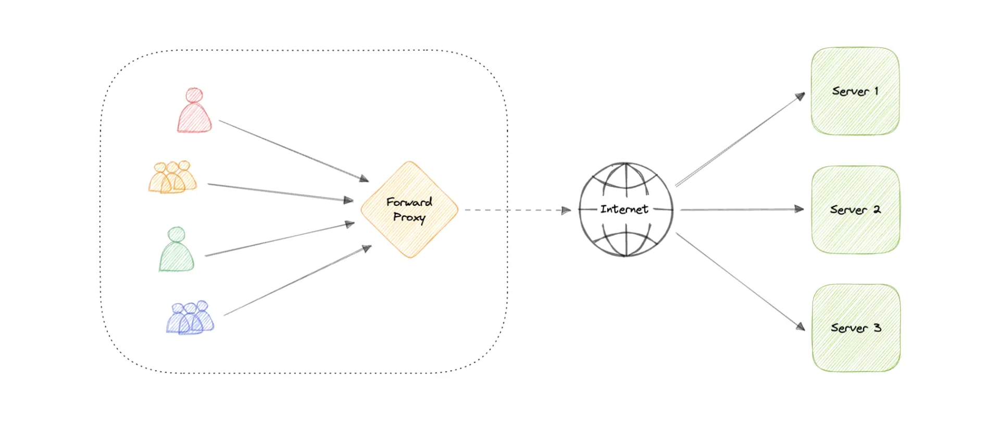
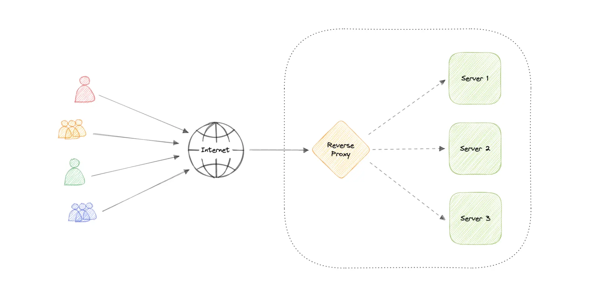

&nbsp;

A proxy server is an intermediary piece of hardware/software sitting between the client and the backend server.

It can modify, monitor, or route requests/responses. Proxies are critical for security, performance, and scalability.

&nbsp;

### **Types of Proxies**

#### **1\. Forward Proxy (Client-Side Proxy)**

A forward proxy, often called a proxy, proxy server, or web proxy is a server tha==t sits in front of a group of client machines.==

When those computers make requests to sites and services on the internet, the proxy server intercepts those requests and then communicates with web servers on behalf of those clients, like a middleman.

****

- **Purpose** : ==Controls outbound traffic from clients== (e.g., in corporate networks).
    
- **Use Cases** :
    
    - Blocking access to restricted websites.
    - Anonymizing client IP addresses.
    - Caching frequently accessed resources.
    - Allows access to <ins>geo-restricted</ins> content
    - Provides anonymity
- **Example** : Squid Proxy, Cloudflare’s 1.1.1.1.
    

&nbsp;

#### **2\. Reverse Proxy (Server-Side Proxy)**

==A reverse proxy is a server that sits in front of one or more web servers, intercepting requests from clients==. When clients send requests to the origin server of a website, those requests are intercepted by the reverse proxy server.

forward proxy sits in front of a client and ensures that no origin server ever communicates directly with that specific client. On the other hand, a reverse proxy sits in front of an origin server and ensures that no client ever communicates directly with that origin server.

- **Purpose** : Handles inbound traffic to servers.
    
- **Use Cases** :
    
    - **Load Balancing** : Distribute traffic across multiple servers.
    - **SSL Termination** : Decrypt HTTPS traffic at the proxy, reducing server load.
    - **Caching** : Serve static assets directly (e.g., images, CSS).
    - **Security** : Hide backend server IPs and block malicious requests.
    - **Compression** : Optimize response sizes (e.g., gzip).
- **Example** : **Nginx** , **HAProxy** , **Spring Cloud Gateway** , **AWS ALB** .
    

&nbsp;

&nbsp;

### **Proxy vs. API Gateway**

- **Proxy** : Focuses on routing and basic transformations.
- **API Gateway** : Advanced proxy with features like:
    - Authentication (JWT, OAuth2).
    - Request/response transformation.
    - Metrics/logging (e.g., Prometheus, ELK).
    - **Example** : **Spring Cloud Gateway** , **Kong** , **AWS API Gateway** .

&nbsp;

&nbsp;