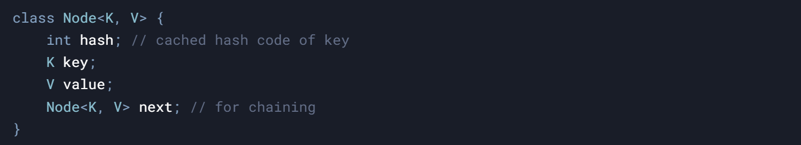

### **HashMap: Deep Dive** 

* * *

#### **1\. Overview**

- **Purpose**: Stores key-value pairs with O(1) average time complexity for `get()` and `put()`.
    
- **Use Case**: Fast lookups, insertions, deletions when order is irrelevant. Ideal for caching, frequency counting, etc.
    
- **Key Features**:
    
    - Allows `null` keys/values (but only one `null` key).
        
    - Not thread-safe (use `ConcurrentHashMap` for concurrency).
        
    - Order not guaranteed (use `LinkedHashMap` for insertion order).
        

#### **2\. Internal Structure**

- **Array of Buckets**:
    
    - Default initial capacity: **16** (Java).
        
    - Each bucket is a **linked list** or **tree** (Java 8+ for large collisions).  
            
        

#### **3\. Hashing Process**

1.  **Hash Code Calculation**:
    
    - Key’s `hashCode()` method generates a 32-bit integer.
        
    - Example: `"key".hashCode() → 106079`.
        
2.  **Compression to Index**:
    
    - Reduce hash code to fit within array bounds: `index = (n - 1) & hash`.
        
    - **Why `(n - 1) & hash`?**  
        If `n` is a power-of-two, this is equivalent to `hash % n` but faster (bitwise operation).
        
    - **Collision**: Different keys may land in the same bucket.
        

&nbsp;

#### **4\. Collision Resolution**

- **Separate Chaining**:
    
    - Each bucket is a linked list. On collision, new nodes are appended.
        
    - **Tree Conversion** (Java 8+):
        
        - If bucket size ≥ `TREEIFY_THRESHOLD` (8), convert linked list to **red-black tree**.
            
        - Avoids O(n) lookup time during excessive collisions (e.g., DoS attacks).
            
        - Reverts to linked list if nodes drop below `UNTREEIFY_THRESHOLD` (6).
            

&nbsp;

#### **5\. Load Factor & Resizing**

- **Load Factor (λ)**:
    
    - Default: **0.75**. Threshold = capacity × load factor.
        
    - When size > threshold, **resize** (double the array size) and rehash.
        
- **Resizing Steps**:
    
    1.  Create new array (2× old capacity).
        
    2.  Recompute indices for all entries (old array → new array).
        
    3.  **Cost**: O(n). Minimize resizes by setting initial capacity wisely.
        

&nbsp;

&nbsp;

#### **6\. Key Operations**

- **`put(K key, V value)`**:
    
    1.  Compute hash → find bucket index.
        
    2.  Traverse bucket (list/tree):
        
        - If key exists (same hash + `equals()` → replace value.
            
        - Else, add new node.
            
    3.  Resize if threshold exceeded.
        
- **`get(K key)`**:
    
    1.  Compute hash → find bucket.
        
    2.  Traverse nodes, compare hash and `equals()`.
        
- **`remove(K key)`**: Similar to `get()`, but remove the node.
    

&nbsp;

&nbsp;

#### **7\. Handling Null Keys**

- **Null Key Handling**:
    
    - Hash code for `null` is **0**.
        
    - Stored in **bucket 0** (treated as a special case).
        
    - Example: `map.put(null, "value")` → stored in bucket 0.
        

&nbsp;

#### **8\. Thread Safety**

- **No Synchronization**: Concurrent `put()` can cause data races or infinite loops during resizing (pre-Java 8).
    
- **Fail-Fast Iterators**: Throw `ConcurrentModificationException` if map is modified during iteration.
    
- **Solutions**: Use `Collections.synchronizedMap()` or `ConcurrentHashMap`.
    

&nbsp;

&nbsp;

#### **9\. Time Complexity**

- **Average Case**: O(1) for `get()`, `put()`, `remove()`.
    
- **Worst Case** (all keys collide): O(log n) with trees (Java 8+), O(n) otherwise.
    

&nbsp;

#### **10\. Design Considerations**

- **Immutable Keys**: Mutable keys can change hash codes → entries become "lost".
    
- **Hash Code Contract**:
    
    - If `a.equals(b)`, then `a.hashCode() == b.hashCode()`.
        
    - Reverse isn’t required (hash collisions allowed).
        
- **Optimizations**:
    
    - Power-of-two sizes for faster index calculation.
        
    - Cached hash codes to avoid recomputation.
        

&nbsp;

#### **11\. Common Interview Questions**

1.  **How does HashMap handle collisions?**  
    *Separate chaining with linked lists, converted to trees for large buckets.*
    
2.  **What happens if two keys have the same `hashCode()`?**  
    *They go to the same bucket. `equals()` determines if keys are identical.*
    
3.  **Why is the initial capacity 16?**  
    *Balances memory and collision probability. Can be tuned based on expected data size.*
    
4.  **What’s the role of `equals()` and `hashCode()`?**  
    *`hashCode()` finds the bucket; `equals()` confirms key identity.*
    
5.  **How does resizing work?**  
    *Array doubles in size, entries rehashed to new buckets.*
    
6.  **Why use trees for collisions?**  
    *Prevent O(n) lookups during collisions (e.g., malicious attacks).*
    
7.  **Is HashMap thread-safe?**  
    *No. Use `ConcurrentHashMap` for concurrent access.*