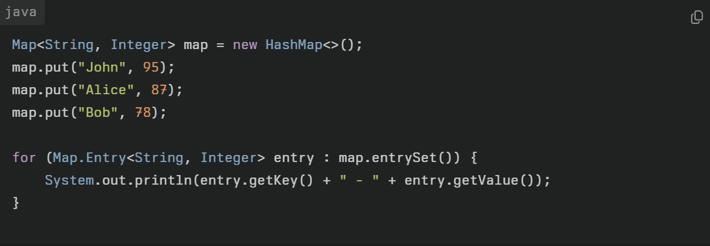
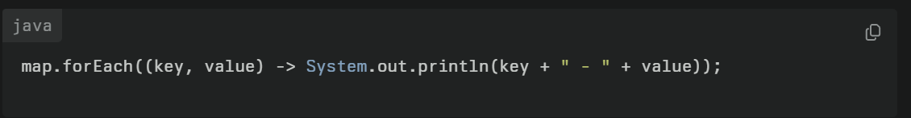
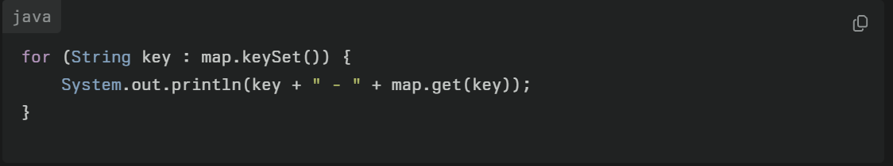
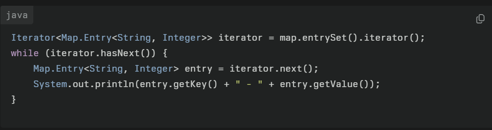
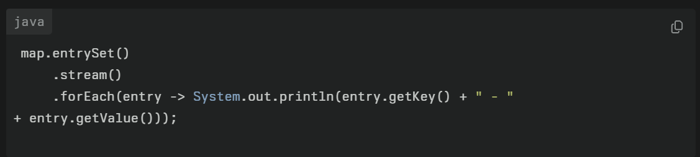

## **1\. Using `entrySet()`**

The `entrySet()` method returns a `Set` view of the map's key-value pairs (`Map.Entry<K, V>`). This is considered the most efficient way to iterate over both keys and values.

&nbsp;

&nbsp;

&nbsp;

&nbsp;

## **2\. Using `forEach()` (Java 8+)**

The `forEach()` method provides a concise way to iterate over a map using lambda expressions.

&nbsp;

## **3\. Using `keySet()`**

The `keySet()` method returns a `Set` view of the keys in the map. You can use it to iterate over the keys and retrieve values using `get()`.

## **4\. Using an Iterator**

You can use an explicit iterator to traverse the entries of the map.

&nbsp;

## **5\. Using Streams (Java 8+)**

Streams allow you to process maps in a functional style.

&nbsp;

&nbsp;

&nbsp;

&nbsp;

&nbsp;

&nbsp;

&nbsp;